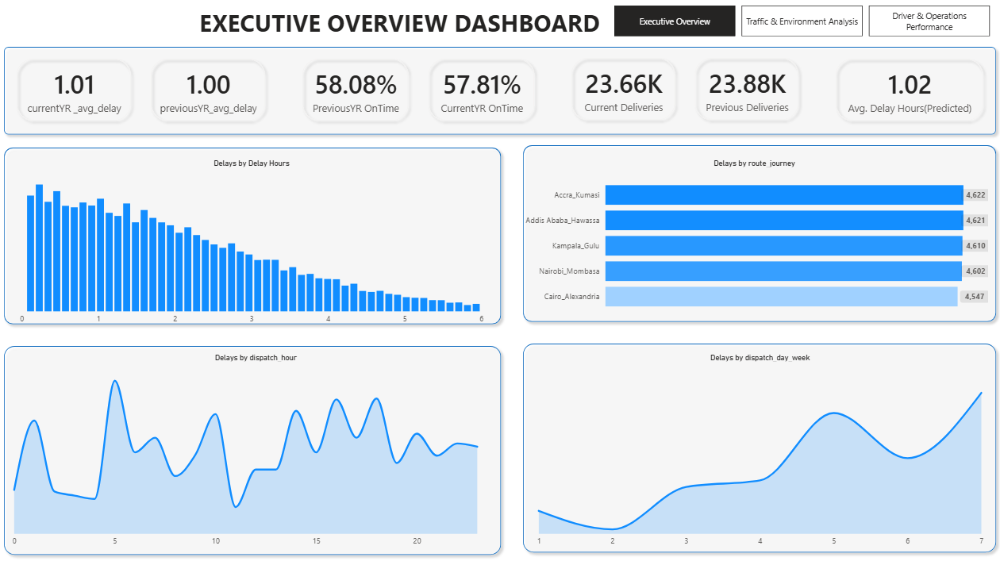
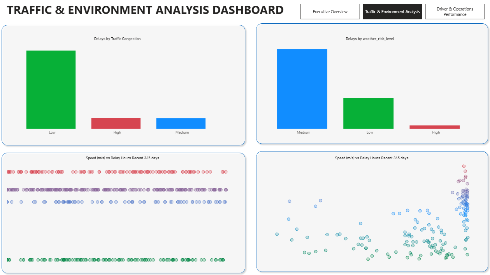

# Delivery Delay Prediction System

## Project Overview
This project develops a machine learning system to predict delivery delay hours in a logistics network. The goal is to enable proactive planning, improve customer communication, and optimize operational efficiency.

---

## Business Problem
Delivery delays are influenced by multiple dynamic factors, including traffic conditions, driver performance, and environmental risks. Traditional estimation methods fail to capture these complexities, leading to inaccurate delivery timelines.

---

## Objectives
- Predict delivery delay in hours
- Engineer meaningful features from operational and GPS data
- Avoid data leakage and ensure realistic model performance
- Compare multiple regression models
- Identify key drivers of delivery delays

---

## Dataset Description
The project integrates three datasets:

- Delivery Data: route, timing, cost, and delay metrics
- GPS Data: speed, movement patterns, congestion signals
- Driver Data: performance, experience, and efficiency metrics

---

## Methodology

### Data Cleaning
- Removed invalid and in-transit deliveries
- Handled missing and inconsistent values
- Filtered unrealistic GPS readings

### Feature Engineering
Key engineered features include:

- Traffic Congestion Level  
  Derived from GPS speed patterns and route-time averages

- Weather Risk Score  
  Proxy variable based on delay patterns, speed, and ratings

- Driver Performance Score  
  Aggregated metric combining ratings, incidents, and efficiency

- Temporal Features  
  Dispatch hour, day of week, and seasonal patterns

---

## Data Leakage Handling
- Removed features such as `on_time` and `expected_delivery_time_duration`
- Ensured all features are available at prediction time

---

## Modeling
Models trained and evaluated:

- Linear Regression
- Random Forest Regressor
- XGBoost Regressor

---

## Model Performance

| Model                  | RMSE   | MAE   | R2    |
|------------------------|--------|--------|--------|
| Linear Regression      | 1.38   | 1.00   | 0.12   |
| Random Forest          | 0.81   | 0.51   | 0.70   |
| XGBoost                | 0.81   | 0.52   | 0.70   |

---

## Insights
- Tree-based models significantly outperform linear models
- Delivery delays are strongly influenced by:
  - traffic congestion
  - driver performance
  - route characteristics
- Removing leakage features reduced performance but improved model reliability
- Random Forest provided the best balance between accuracy and stability

---

## Challenges
- Lack of external traffic and weather data
- Risk of data leakage from derived features
- High variability in delivery conditions

---

## Conclusion
The project demonstrates how meaningful feature engineering and careful modeling can produce reliable delay predictions in logistics. While performance is moderate (R2 ≈ 0.70), the model is realistic and aligned with real-world deployment constraints.

---
```
## Project Structure
├── data/
├── notebooks/
├──dashboard
├── models/
├── README.md
```
---

## Future Work
- Add cross-validation for robustness
- Perform feature importance and SHAP analysis
- Integrate real-time traffic and weather APIs
- Build a deployment-ready prediction API
---

## Dashboard Preview




---



---
